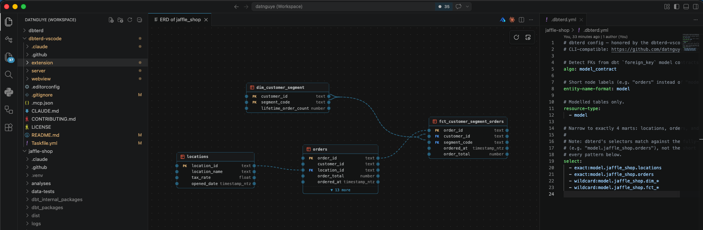
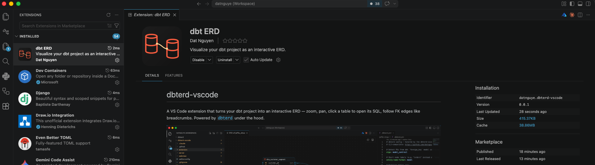
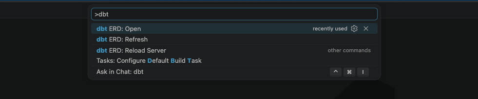
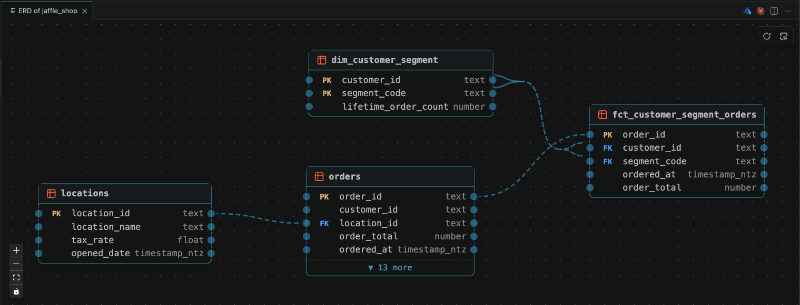

# dbt ERD — Proof of Concept Demo

A five-minute walkthrough showing the extension rendering a real dbt project as
an interactive ERD. We'll use the
[jaffle-shop](https://github.com/il-dat/jaffle-shop) example — the canonical
"hello world" for dbt.

## Table of Contents

- [dbt ERD — Proof of Concept Demo](#dbt-erd--proof-of-concept-demo)
  - [Table of Contents](#table-of-contents)
  - [What you'll see](#what-youll-see)
  - [Prerequisites](#prerequisites)
  - [Step 1 — Set up the dbt project](#step-1--set-up-the-dbt-project)
  - [Step 2 — Install the extension](#step-2--install-the-extension)
  - [Step 3 — Open the ERD](#step-3--open-the-erd)
  - [Step 4 — Explore the diagram](#step-4--explore-the-diagram)
  - [Step 5 — Edit `.dbterd.yml`, refresh](#step-5--edit-dbterdyml-refresh)
  - [Troubleshooting](#troubleshooting)
  - [What's next](#whats-next)

## What you'll see

By the end of this walkthrough you'll have:

- The jaffle-shop models rendered as draggable table cards
- Foreign-key edges drawn between columns (not just between tables)
- Click-to-open-SQL working on every table header
- A one-shot refresh flow after editing `.dbterd.yml` or re-running `dbt docs generate`

<!-- SCREENSHOT NEEDED [1/6]
Full-window capture of VS Code with the ERD panel open, showing the
jaffle-shop marts (customers, orders, order_items, products, supplies, stores)
laid out with FK edges visible.
Recommended size: 1920×1080 or larger, PNG.
Save as: docs/images/demo-overview.png
-->



## Prerequisites

- **VS Code 1.85+**
- **Python 3.10+** on `PATH` (the extension spawns a small FastAPI server that
  wraps `dbterd`)
- **Git** and **`dbt-core`** with an adapter of your choice (DuckDB is easiest
  for the demo)

```bash
# Quick check
python3 --version    # -> 3.10 or higher
code --version       # -> 1.85.0 or higher
```

## Step 1 — Set up the dbt project

Clone jaffle-shop and compile it so `target/manifest.json` exists — that's the
file the extension reads.

```bash
git clone https://github.com/il-dat/jaffle-shop ~/demo/jaffle-shop
cd ~/demo/jaffle-shop

# Create a virtualenv (the extension prefers the project's .venv)
python3 -m venv .venv
source .venv/bin/activate

pip install dbt-duckdb

# Bootstrap a DuckDB profile and generate docs
dbt deps
dbt docs generate  # <- writes target/manifest.json and target/catalog.json
```

You should end up with `target/manifest.json` and `target/catalog.json` inside
the project. Those two files are the entire contract between your dbt project
and the extension.

## Step 2 — Install the extension

Install from the Visual Studio Marketplace:
**[marketplace.visualstudio.com/items?itemName=datnguye.dbterd-vscode](https://marketplace.visualstudio.com/items?itemName=datnguye.dbterd-vscode)**

Click **Install** on the Marketplace page and VS Code will prompt to open and
add the extension. Alternatively, search for **dbt ERD** inside VS Code's
Extensions view (`Cmd/Ctrl+Shift+X`) and install it there.

For offline sideloads, grab a `.vsix` from the
[Releases page](https://github.com/datnguye/dbterd-vscode/releases) and install
via the Extensions view → `…` menu → **Install from VSIX…**.

<!-- SCREENSHOT NEEDED [2/6]
VS Code Extensions sidebar showing "dbt ERD" by datnguye in the
"Installed" section, with the version badge visible.
Save as: docs/images/demo-install.png
-->



## Step 3 — Open the ERD

1. Open the jaffle-shop folder in VS Code: `code ~/demo/jaffle-shop`
2. Open the Command Palette: `Cmd+Shift+P` (macOS) / `Ctrl+Shift+P` (Win/Linux)
3. Run **dbterd: Open ERD**

The extension auto-detects the dbt project root by walking up from the open
workspace folder until it finds `dbt_project.yml`. The first launch takes a few
seconds — it bootstraps a Python virtualenv for the managed server on first
run, then caches it for subsequent launches.

<!-- SCREENSHOT NEEDED [3/6]
Command Palette open with "dbterd: Open ERD" highlighted (or typed in the
input). The ERD panel is NOT yet open in this frame — this is the "launch"
moment.
Save as: docs/images/demo-command-palette.png
-->



## Step 4 — Explore the diagram

Once the panel loads, you can:

- **Drag** any table card by its header to rearrange the layout
- **Zoom** with trackpad pinch or `Cmd/Ctrl`+scroll
- **Pan** by clicking and dragging the background
- **Click a column name** on a table to see its FK edge highlight to the
  related column (if a `relationships` test is declared in the dbt project)
- **Click the table header** to open that model's `.sql` file in the editor

<!-- SCREENSHOT NEEDED [4/6]
Close-up on two tables (e.g., stg_orders and stg_customers) with an FK edge
highlighted between them. Column names should be legible. Annotate with arrows
if possible.
Save as: docs/images/demo-fk-hover.png
-->



## Step 5 — Edit `.dbterd.yml`, refresh

The extension honors a `.dbterd.yml` at the dbt project root on every open and
every refresh. That's the fastest way to reshape the ERD without touching any
model code — tweak a selector, save, refresh, done.

Open `.dbterd.yml` in the jaffle-shop project:

```yaml
# .dbterd.yml
algo: model_contract
entity-name-format: model
resource-type:
  - model
select:
  - exact:model.jaffle_shop.locations
  - exact:model.jaffle_shop.orders
  - wildcard:model.jaffle_shop.dim_*
  - wildcard:model.jaffle_shop.fct_*
```

Try narrowing the scope — drop the `fct_*` wildcard so the fact tables
disappear from the diagram:

```yaml
select:
  - exact:model.jaffle_shop.locations
  - exact:model.jaffle_shop.orders
  - wildcard:model.jaffle_shop.dim_*
```

Save, then in VS Code: **Command Palette → dbterd: Refresh ERD**. The webview
re-fetches `/erd` from the local server and re-lays out the graph with the new
selection. No extension restart, no re-running `dbt docs generate` — the
config file is re-read on every refresh.

> **Tip:** dbterd selectors match the fully-qualified `node_name`
> (`model.jaffle_shop.orders`), not the short name. That's why every pattern
> needs the `model.<project>.` prefix.

## Troubleshooting

**Nothing happens when I run "Open ERD".**
Check the Output panel → select **dbt ERD** from the dropdown. The server logs
appear there. The most common cause is a missing `target/manifest.json` — run
`dbt docs generate` first.

**"Python not found" or the server never becomes ready.**
Set `dbterd.pythonPath` in VS Code settings to a specific Python 3.10+ binary.
By default the extension looks for (in order): the dbt project's `.venv`,
`$VIRTUAL_ENV`, then `python3` on `PATH`.

**FK edges aren't showing up.**
`dbterd` infers relationships from one of three sources, picked by the `algo`
setting in `.dbterd.yml` (or the `--algo` flag):

- **`test_relationship`** (default) — reads dbt
  [`relationships` tests](https://docs.getdbt.com/reference/resource-properties/data-tests#relationships)
  declared in your schema YAML
- **`model_contract`** — reads `foreign_key` constraints from dbt model
  contracts (requires dbt 1.9+); this is what the jaffle-shop `.dbterd.yml`
  above uses
- **`semantic`** — reads entity definitions from the dbt Semantic Layer

If no edges appear, your project probably hasn't declared any of those yet
for the `algo` you've chosen. Plain column-name matching is intentionally not
used — it produces too many false positives on real projects. See the
[dbterd algorithm guide](https://dbterd.datnguyen.dev/nav/guide/choose-algo)
for examples.

## What's next

- Star the repo → [github.com/datnguye/dbterd-vscode](https://github.com/datnguye/dbterd-vscode)
- File bugs and feature requests → [Issues](https://github.com/datnguye/dbterd-vscode/issues)
- Contributing guide → [CONTRIBUTING.md](../CONTRIBUTING.md)
